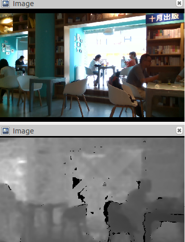
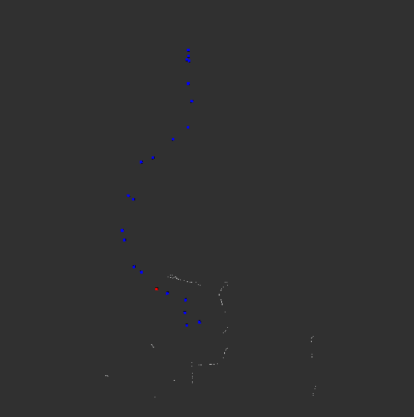
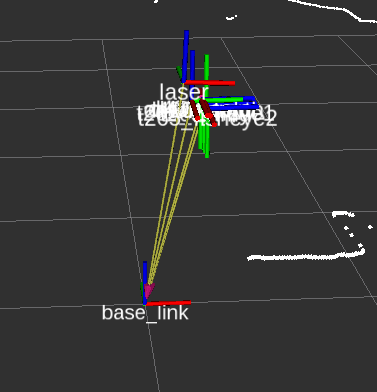
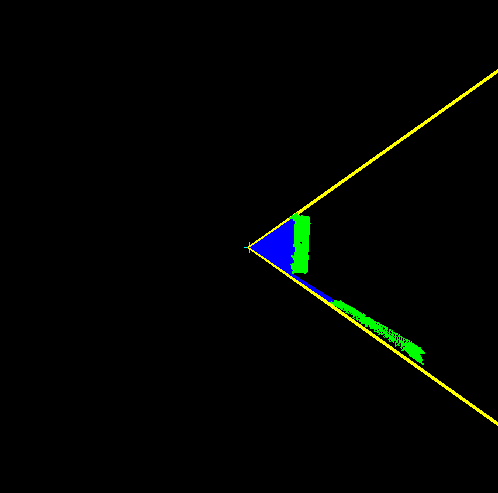
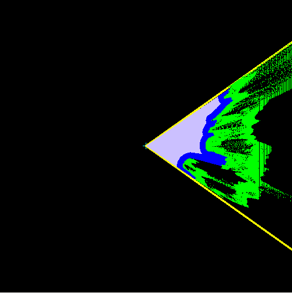
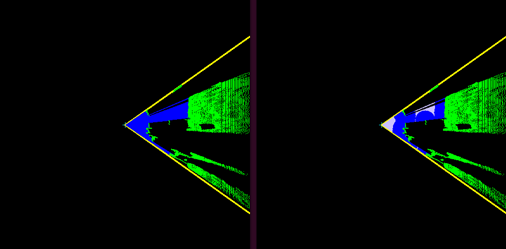

<!--
 * @Author: your name
 * @Date: 2019-12-23 03:29:32
 * @LastEditTime : 2019-12-31 12:03:31
 * @LastEditors  : Please set LastEditors
 * @Description: In User Settings Edit
 * @FilePath: /catkin_ws/src/costmap_lrgbd_ros/README.md
 -->
# 代价地图与智能导航程序

## 1. 整个流程

深度图， 局部障碍物地图， RGBD局部代价地图， 局部代价地图可视化图

- step1 将深度图转化为点云
- step2 对点云进行xz平面的投影
- step3 利用射线法检测出可通行区域，蓝色为通行区域，绿色为障碍物，黑色为未知区域
- step4 障碍物膨胀
- step5 获取并生成一个waypoint，转换到机器人坐标系下
- step6 利用DWA算法计算机器人到达waypoint的速度，控制机器人移动

## 2 博客

随着3D相机的普及和3D激光传感器价格的降低，机器人依靠3D传感器视觉避障和路径规划方案逐渐成为趋势。

近期采用3D相机进行了路径规划的仿真和实测。

##### 蓝色路标点表示机器人需要经过的waypoints

##### 机器人眼中的世界
黄线为机器人深度相机视角，黑色为未知区域，绿色为障碍物，蓝色为空闲区域

##### 膨胀后的局部地图

##### 机器人逐渐靠近目标物 
